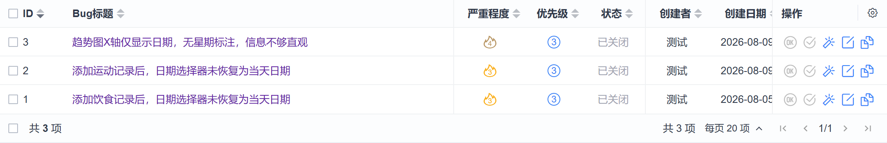
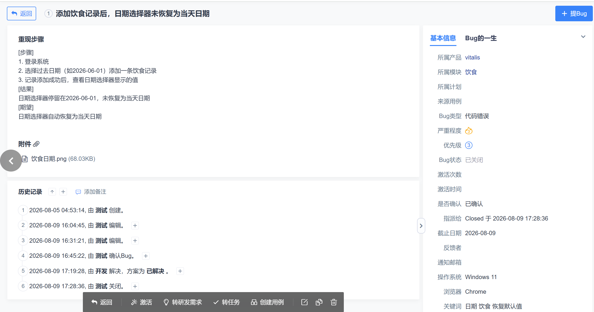
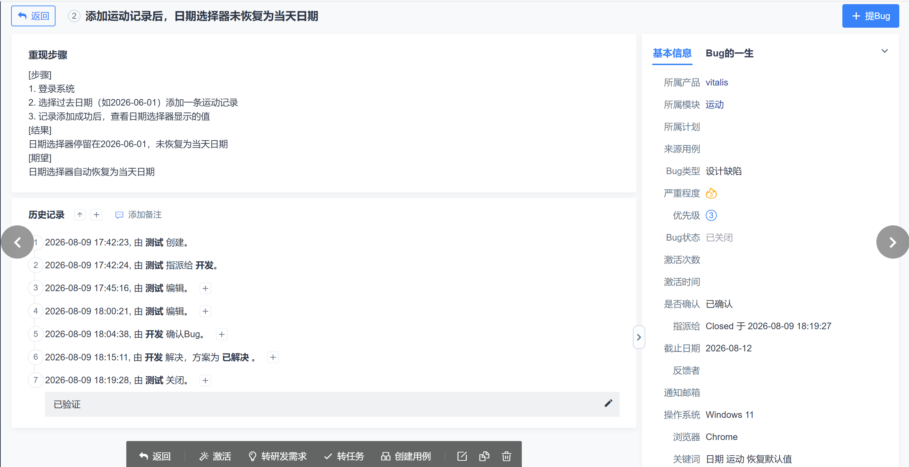
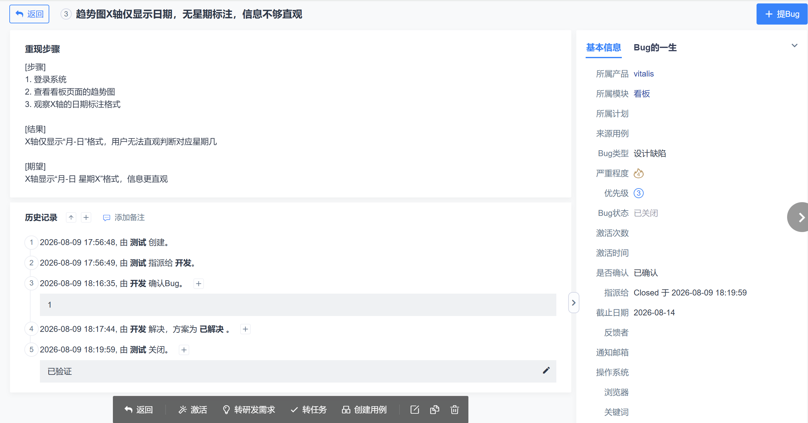

# 缺陷汇总

> 本文件为本次测试缺陷总览清单，实际缺陷完整流转过程以禅道记录为准，相关截图见仓库screenshots目录。

| 缺陷编号 | 关联用例 | 模块 | 优先级 | 状态 | 缺陷现象 | 建议 |
|---|---|---|---|---|---|---|
| BUG-01 | DIET-029 | 饮食 | P2 | 已关闭 | 添加过去日期的饮食记录后，日期输入框未恢复为当天日期 | 添加成功后将日期重置为当天 |
| BUG-02 | EXER-029 | 运动 | P2 | 已关闭 | 添加过去日期的运动记录后，日期输入框未恢复为当天日期 | 添加成功后将日期重置为当天 |
| BUG-03 | DASH-003 | 看板 | P2 | 已关闭 | 趋势图 X 轴仅显示月-日，没有星期 | 增加星期信息，提高趋势图可读性 |

## 禅道缺陷列表

